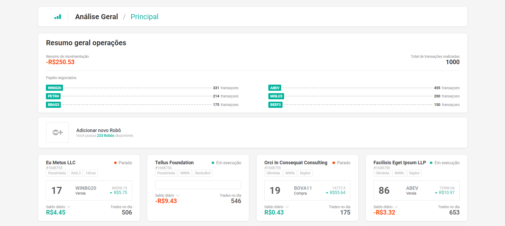
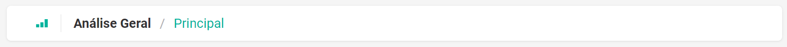
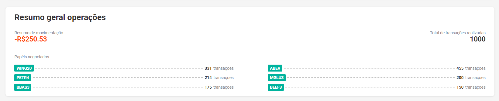
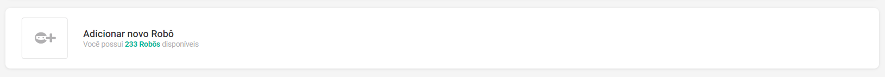
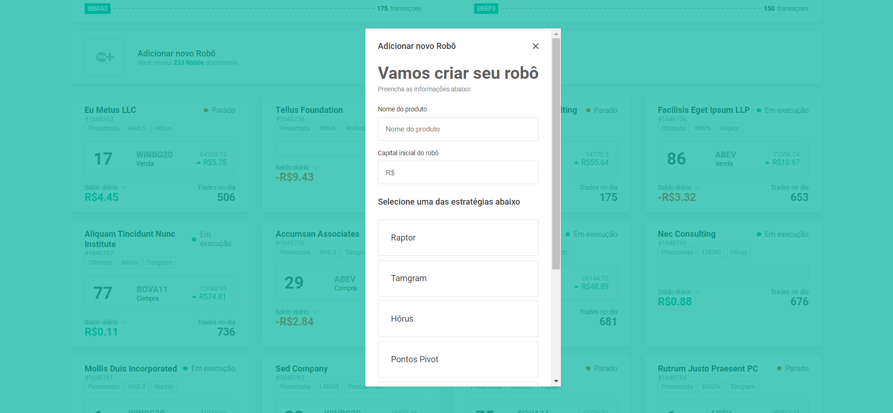
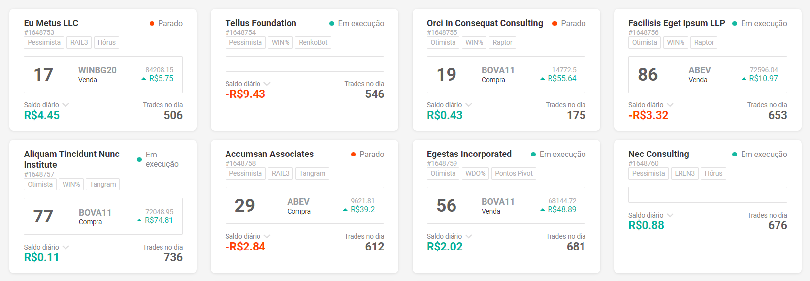

<h1 align="center"> Desafio - SmarttBot Front-end  </h1>

<p align="center">
Esse projeto é um desafio proposto pela equipe da SmarttBot para aplicação front-end. Gostei bastante de implementar essa aplicação e agradeço pelo desafio!<br/>
</p>

<p align="center">
  <a href="#-visão-geral">Visão Geral</a>&nbsp;&nbsp;&nbsp;|&nbsp;&nbsp;&nbsp;
  <a href="#-executando-o-projeto">Executando o Projeto</a>&nbsp;&nbsp;&nbsp;|&nbsp;&nbsp;&nbsp;
  <a href="#-projeto">Projeto</a>&nbsp;&nbsp;&nbsp;|&nbsp;&nbsp;&nbsp;
  <a href="#-tecnologias">Tecnologias</a>&nbsp;&nbsp;&nbsp;
</p>

<br>

## 👀 Visão Geral
---

<p align="center">

</p>

<br>

## 🚀💻 Executando o Projeto
---

Clone o projeto e acesse a pasta:
```bash
git clone https://github.com/Lorena-Avelino/teste-frontend.git

cd teste-frontend
```

Execute esses comandos para instalar as dependências e executar o projeto:
```bash
npm install
npm run dev
```
O projeto estára executando em http://localhost:5173/

<br>

## 💻 Projeto
---
### Componentes 

- <details>
    <summary>BreadCrumbs</summary>
        <p align="left">
        Esse é o componente que permite identificar o título da página que está sendo exibida. No momento é um componente estático. Caso houvesse mais paginas nessa aplicação, esse componente poderia ser alterando e se tornar dinâmico.
        
        </p>

    ```javascript
    import './style.css'
    import combinedShape from '../../assets/CombinedShape.svg'

    const BreadCrumbs = () => {
        return (
            <div className='breadCrumbs'>
                
                <div className='retangle'></div>
                <h2 className='menu'>Análise Geral <div className='barra'>/</div> <div className='principal'>Principal</div></h2>
            </div>
        )
    }

    export default BreadCrumbs
    ```
</details>

- <details>
    <summary>Report</summary>
        <p align="left">
        Esse é o componente que mostra o resumo geral das operações inclusive os papéis negociados. Dentro dele foi criado outro componente chamado PapelNegociado para buscar os papeis negociados e foi utilizado getRobotOverview() para buscar os dados da api.
        
        </p>

    ```javascript
    import Saldo from '../common/saldo'
    import SubTitle from '../common/subtitle'
    import PapelNegociado from './papelnegociado'
    import './style.css'
    import { useEffect, useState } from 'react'
    import { getRobotOverview } from '../../services/api'

    const Report = () => {
        const [robotsOverview, setRobotsOverview] = useState(null)

        const fetchRobots = async () => {
            try{
                const response = await getRobotOverview()
                setRobotsOverview(response)
            }catch(error){
                alert("Falha ao buscar");
            }finally{
                console.log("fez a chamada")
            }
        }

        useEffect(() => {
            fetchRobots()
        }, [])

        return (
            <div className="report">
                <h2 className='title'>Resumo geral operações</h2>
                <div className='resume-total'>
                    <div className='resume'>
                        <SubTitle title='Resumo de movimentação'/>
                        <Saldo title={robotsOverview?.moviment_summary}/>
                    </div>
                    <div className='total'>
                        <SubTitle title='Total de transações realizadas'/>
                        <span className='total-transacao'>{robotsOverview?.transactions}</span>
                    </div>
                </div>
                <div className='retangle'></div>
                <SubTitle title='Papéis negociados'/>
                <div className='papeis-negociados'>
                    {robotsOverview?.papers.map((item)=>(
                        <div key={item.nome} className='papel-negociado'>
                            <PapelNegociado title={item.name}/>
                            <div className='linha-pontilhada'></div>
                            <span className='quantidade-transacoes'>{item.trasactions}</span>
                            <SubTitle title='transaçoes'/>
                        </div>
                    ))}
                </div>
            </div>
        )
    }

    export default Report
    ```
</details>

- <details>
    <summary>NewRobot</summary>
        <p align="left">
        Esse é o componente que nos mostra a quantidade de robôs disponível e que também tem um botão para o cadastro de novos robôs, que ao ser clicado, abre uma outra componente (AddNewRobot) que é um pop-up.
        
        </p>

    ```javascript
    import './style.css'
    import addRobot from '../../assets/AddRobot.svg'
    import {useState} from "react"
    import AddNewRobot from '../addnewrobot'

    const NewRobot = ({updateListRobot, disponiveis}) => {
        const[isAddNewRobotOpen, setIsAddNewRobotOpen] = useState(false)

        const handleOpenAddNewRobot = () => {
            setIsAddNewRobotOpen(true)
        }

        const handleCloseAddNewRobot = () => {
            setIsAddNewRobotOpen(false)
        }

        return (
        <div className='new-robot'>
            <button className='btn' onClick={handleOpenAddNewRobot}></button>
            <div>
                <h2 className='new'>Adicionar novo Robô</h2>
                <p className='quantity-robot'>Você possui <strong>{disponiveis} Robôs</strong> disponíveis</p>
            </div>
            <AddNewRobot isOpen={isAddNewRobotOpen} onRequestClose={handleCloseAddNewRobot} ariaHideApp={false} shouldCloseOnOverlayClick={true} updateListRobot={updateListRobot}/>
        </div>
        )
    }

    export default NewRobot
    ```
</details>

- <details>
    <summary>AddNewRobot</summary>
        <p align="left">
        Esse é o componente que é aberto como pop-up após ser clicado no botão do componente NewRobot. <br> <br>
        Dentro dessa componente foi adicionada as commponentes Characteristic (inputs type="text" do componente) e StrategyGroup (grupo de inputs type="radio") e dentro da componente StrategyGroup foi chamada a componente Strategy (usada para buscar e estilizar um componente Strategy). <br> <br>
        Quando clicar no botão "Criar Robô", um novo robô é criado e a pagina é renderizada com esse novo robô adicionado à tela. <br> <br>
        Ao clicar no botão "Cancelar" ou no "X" do canto superior direito, a componente é fechada e volta à página inicial. <br> <br>
        
        </p>

    ```javascript
    import './style.css'
    import SubTitle from '../common/subtitle'
    import Characteristic from './characteristic'
    import StrategyGroup from './strategygroup'
    import Fechar from '../../assets/Union.svg'
    import ReactModal from 'react-modal'
    import { getStrategy, postRobot } from '../../services/api'
    import { useEffect, useState } from 'react'

    const AddNewRobot = ({isOpen, onRequestClose, updateListRobot}) => {
        const [robot, setRobot] = useState({mode: 0, simulation: 0})

        const handleChange = (name, value) => {
            setRobot((prevRobot) => ({...prevRobot, [name]: value}))
        }

        const onSubmit = async (event) => {
            event.preventDefault()
            try{
                const response = await postRobot(robot)
                setRobot({mode: 0, simulation: 0})
                onRequestClose()
                await updateListRobot()
                console.log(response)
            }catch(error){
                alert("Falha ao criar robô");
            }finally{
                console.log("fez a chamada")
            }
        }

        const [strategies, setStrategies] = useState([])

        const fetchStrategies = async () => {
            try{
                const response = await getStrategy()
                setStrategies(response)
            }catch(error){
                alert("Falha ao buscar estratégias");
            }finally{
                console.log("fez a chamada")
            }
        }

        const updateOverlayHeight = () => {
            const overlayElement = document.querySelector('.background')
            if (overlayElement) {
                overlayElement.computedStyleMap.height = `${window.innerHeight}px`
            }
        }

        useEffect(() => {
            updateOverlayHeight()
            
            fetchStrategies()
            window.addEventListener('resize', updateOverlayHeight)
            return () => {
                window.removeEventListener('resize', updateOverlayHeight)
            }

        }, [])
        const handleChangeValue = ({ target }) => {
            if (target.value) {
            handleChange("initial_capital", Number(target.value.replace(/\D/g, "")) / 100);
            } else {
            handleChange("initial_capital", null);
            }
        };
        
        const showInputValue = (valueToConvert) => {
            if (valueToConvert) {
            const value = Number(valueToConvert);
            const valueString = value.toLocaleString("pt-BR", {
                minimumFractionDigits: 2,
                maximumFractionDigits: 2,
                style: "currency",
                currency: "BRL",
            });
            return valueString;
            }
        
            return "";
        };
        
        return (
            <ReactModal isOpen={isOpen} onRequestClose={onRequestClose} ariaHideApp={false} className='add-new-robot' overlayClassName="background" bodyOpenClassName="overflow">
                <div className='janela'>
                    <h1 className='add'>Adicionar novo Robô</h1>
                    
                </div>
                <h2 className='criar'>Vamos criar seu robô</h2>
                <SubTitle title='Preencha as informações abaixo:'/>
                <form className='formulario' onSubmit={onSubmit}>
                    <Characteristic form='nome' titulolabel='Nome do produto' name={"title"} placeholder='Nome do produto' value={robot.title} onChange={(event) => {handleChange("title", event.target.value)}}/>
                    <Characteristic form='capital' titulolabel='Capital inicial do robô' placeholder='R$' value={showInputValue(robot.initial_capital)} onChange={handleChangeValue}/>
                    <p className='estrategias'>Selecione uma das estratégias abaixo</p>
                    <StrategyGroup strategies={strategies} selectedStrategy={robot.strategy_id} setSelectedStrategy={(value) => {handleChange("strategy_id", value)}}/>
                    <div className='submeter'>
                        <button className='cancelar' onClick={onRequestClose}>Cancelar</button>
                        <button className='criar-robo' type='submit'>Criar robô</button>
                    </div>
                </form>
            </ReactModal>
        )
    }

    export default AddNewRobot
    ```
</details>

- <details>
    <summary>Robot</summary>
        <p align="left">
        Esse é o componente que nos mostra os dados de todos os robôs. <br> <br>
        Dentro do componente é chamada as componentes RobotPrice (são os dados last_paper da api), RobotProperty (são as propriedades dos robôs (simulation, stock_codes, strategy)) e RobotStatus (para saber se o robô está parado ou em execução)
        
        </p>

    ```javascript
    import RobotPrice from './robotprice'
    import RobotProperty from './robotproperty'
    import RobotStatus from './robotstatus'
    import SubTitle from '../common/subtitle'
    import Saldo from '../common/saldo'
    import Seta from '../../assets/Shape.svg'
    import './style.css'

    const Robot = ({robots}) => {
        return (
            <div className='robots'>
                {robots.map((item)=>(
                    <div key={item.id} className='robot'>
                        <div className='robot-status'>
                            <h1 className='name'>{item.title}</h1>
                            <RobotStatus name={item.running}/>
                        </div>
                        <p className='robot-id'>#{item.id}</p>
                        <RobotProperty title={item.simulation === 0 ? "Otimista" : (item.simulation === 1 ? "Pessimista" : null)}/>
                        <RobotProperty title={item.stock_codes}/>
                        <RobotProperty title={item.strategy}/>
                        <RobotPrice number={item.last_paper?.position} name={item.last_paper?.paper} preco={item.last_paper?.paper_value} valor={item.last_paper?.profit} type_paper={item.last_paper?.type}/>
                        <div className='dia'>
                            <div className='saldo'>
                                <div className='saldo-diario'>
                                    <SubTitle title='Saldo diário'/>
                                    
                                </div>
                                <Saldo title={item.daily_balance}/>
                            </div>
                            <div className='trades'>
                                <SubTitle title='Trades no dia'/>
                                <span className='trade'>{item.number_trades}</span>
                            </div>
                        </div>
                    </div>
                ))}
            </div>
        )
    }

    export default Robot
    ```
</details>

<br>

### Utils
- <details>
    <summary>Axios</summary>
    O fetching de dados utilizado foi o Axios. <br>
    <a href="https://axios-http.com/ptbr/docs/intro">Axios - Documentation</a>
</details>

- <details>
    <summary>React Modal</summary>
    Utilizei React Modal para fazer o pop-up para adicionar um novo robô. <br>
    Ele me auxiliou bastante no desenvolvimento com divérsos métodos importantes. <br>
    <a href="https://reactcommunity.org/react-modal/">React Modal - Documentation</a>
</details>

<br>

### Considerações
- Durante a implementação percebi que tinha alguns robôs da API que não tinham os dados do objeto last_paper, então, para esses casos, decidi deixar esses campos em branco, mostrando somente o quadrado vazio(sem dados).
- Fiquei na dúvida em qual dado da API seria inserido na componente NewRobot, no campo de quantidade de Robôs disponíveis. Então, eu coloquei o dado como sendo a quantidade total de robôs exibidos na pagina.
- Os robôs que são adicionados pelo usuário são adicionados no final na página.


<br>

## 🚀 Tecnologias
---

Esse projeto foi desenvolvido com as seguintes tecnologias:

- HTML
- CSS
- JavaScript
- ReactJs
- Axios
- React Modal
- Vite